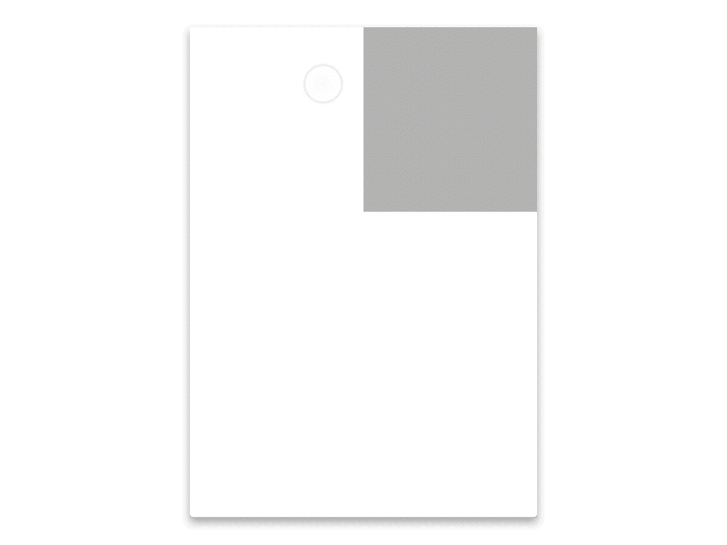
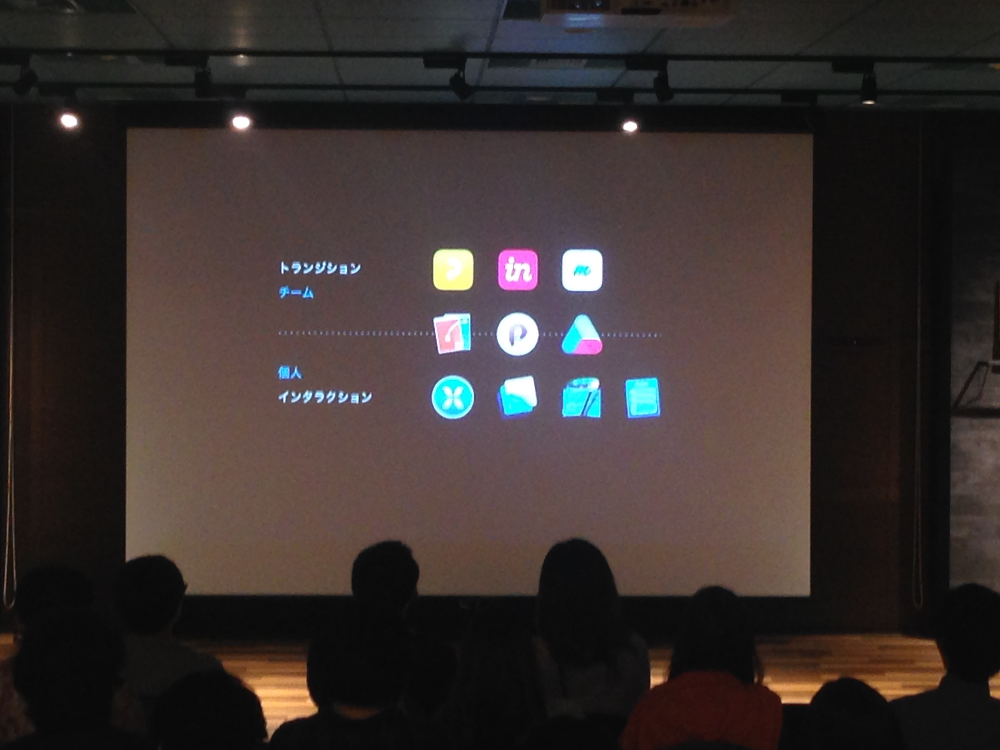

インタラクションツール最前線！これからのUIデザイナーに求められるスキルとは？ @dots
---
http://eventdots.jp/event/569828

# プロトタイピングツールの使い分け/株式会社スタンダード 吉竹 遼
（遅れて聞けなかった、、、）

# Pixateをなぜ導入したのか？/株式会社サイバーエージェント 及川 和之
## 導入の経緯
* ネイティブエンジニアのリソースが足りない
* インタラクション以外の部分でリソースがパツパツ  
 -> デザイナーでインタラクションの検討を行う必要になった

## 候補になったツール
 1. AffterEffects
 1. Flash  
 -> 使えるデザイナーは多いが、プロトタイプツールではない
 1. invision  
 -> サイト全体の構成とかを見るのには良い
 1. Proto.io  
 -> 細かいところ作れるけど、ちょっと複雑そう
 1. Pixate  
 -> 条件式が使えるので、割と複雑なことができる

* 実機で触れないと、スマホアプリのUXとしては不満  
    -> 4,5が良い

* Pixateにした  
 今はSOLOプランがフリーになっている

## まとめ
 * スマホ実機プレビューは大きい
 * シンプルな動きの表現であればpixateでけっこういける
 * 頑張れば複雑なものもいける
 * 複数オブジェクトを同時に動かすのはかなり面倒
 * プロトタイプを作ると意見が活発になった

# Pixateで制作、どれくらい時間がかかる？/株式会社サイバーエージェント 中 隆理
## Ameba古着屋を作る
1. スクロール
  * 縦にスクロール
  * 動き・変化をスクロール

  -> ルールさえ知っていれば3分ぐらいでできる
1. スクロールしたら○○する  
-> それぞれ10分ぐらいでできる
1. if文を書く
  * 下にスクロールしたら〜する
  * 上にスクロールしたら〜する
  -> 書き方が決まっているし、1〜2文程度でかける
  * タブの動きは定番の条件式で実現できる
  * スクロールの方向や距離が取れる  
  -> それぞれ10分ぐらいでできる
1. 遷移（タップ）
  * 画面外にある画像を所定の位置まで動かす
  * 時間差でアニメーションさせることもできる  
-> それぞれ5分
1. できないことをそれっぽく実現する
  * スクロールした時に画像にブラー  
-> できないことはけっこうあるけどそれっぽく見せることがしやすい    
-> それぞれ10分

### 3〜4画面の遷移、各ページのアニメーションといった規模なら3〜4時間のイメージ

## Licaを作る（カレンダーアプリでリリースはしていない）
### 画面数がやたら多い
1. Lica制作で難しかったところ
  * drag設定でスワイプを表現できる  
  -> Xcodeのシュミレータで動かすこともできる  
  -> 60分  
  スワイプを起点とした画面遷移は見え方、レイヤー構造、条件式を考えるのに時間が掛かる
1. 15〜20画面ぐらいのけっこう大量の画面  
  -> まるまる2日かかった   
  -> かなりしんどかった

1. アニメーション
  * シンプルなアニメーションは簡単
  * オリジナルのアニメーションは難しい

# インタラクションツールライブデモ/ヤフー株式会社 宇野 雄
## Principleで実装する様子
* レイヤーが自分で作れる
* 昔のFlashに感覚的に近い
* レイヤーをtweenでつなげてアニメーションできる
* プロパティはサイズや位置など様々ある
* ファイル名に@3xをつけるとサイズに反映させてくれる  
-> InterFacceBuilderの簡易版みたいな感じ
* sketchとショートカットが同じものが多い  
  -> pixateはWebでの操作から始まっているので操作感がまだイマイチな感じ
* タップ領域は透明にしたレイヤーを使う
* タイムラインがある  
  -> フレームでアニメーションの調整ができる
* ビルドが不要でリアルタイムで確認できる
* デモ用のgif画像、movが作りやすい  
-> これ5秒ぐらいでできる！  
（これぐらいできてもあんまり意味ないかもですが、Xcodeでやると5分はかかると思う、、、しかも、アニメーションgifで書き出すとかできないし）
  

* 条件式（if文）はないがドライバという機能がある  
  -> プロパティに応じてアニメーションの変化量を調整できる  
  -> 複雑なことはできない
* アートボードという概念がある（Pixtateにはない）
* 入口として一番ハードルが低いと思う

# 今後求められるプロトタイピングスキル/株式会社グッドパッチ 小林 幸弘
## なぜプロトタイプを作るのか

  最終成果物の種類が変わってきている    
  -> アニメーションの動きもエンジニアでなくてもデザイナーが作れるようになっている  
  -> より本物に近いものが作れるようになっている  

  * 使いやすさの検証  
    -> 感触確認・ユーザビリティテスト
  * コラボレーションの活性化  
    -> デザイン共有・意思決定

## どうやってプロトタイプするか
トランジション型（遷移メイン）<->インタラクション型（画面内の細かいアニメーション）     
  
-> 各ツールごとに特性があるので目的に応じて使い分けるのが理想
## 必要なスキル
  * インタラクションを作る必要性を疑う
    -> OS標準ではないカスタムアニメーションを作りやすくなったが、  
      -> 作り出すタイミングがむずかしくなった  
      -> OS標準で良いのではないか
  * インタラクションより構造設計  
    -> アニメーションの前にユーザがどこにいるかとかがわからなかったら台無し
  * インタラクションをコンポーネントで考える  
    ->  要素の数が増えたら使えない、全体で統一されていること
## プロトタイピングツールに触れる時間を減らす
  * グラフィックツールを触る時間より、プロトタイピングツールを触る時間が長いのは良くない  
  -> 検証やコミュニケーションが目的なのでそこにも時間を使わないと意味がない

# 感想
* PixtateかPrincipleのどちらか押しな感じでしたが、エンジニアがイメージ共有のために使うならPrincipleがかなり簡単に使えそうで良さそう。if文とか書き出すなら実装してしまいたいし。  
チーム共有だったらProttが良いらしいが、ちょっと発表だけでは判断できなかった。
* プロトタイプなのか開発なのか、フィージビリティの検証なのかをもう少し区別して考えたい
