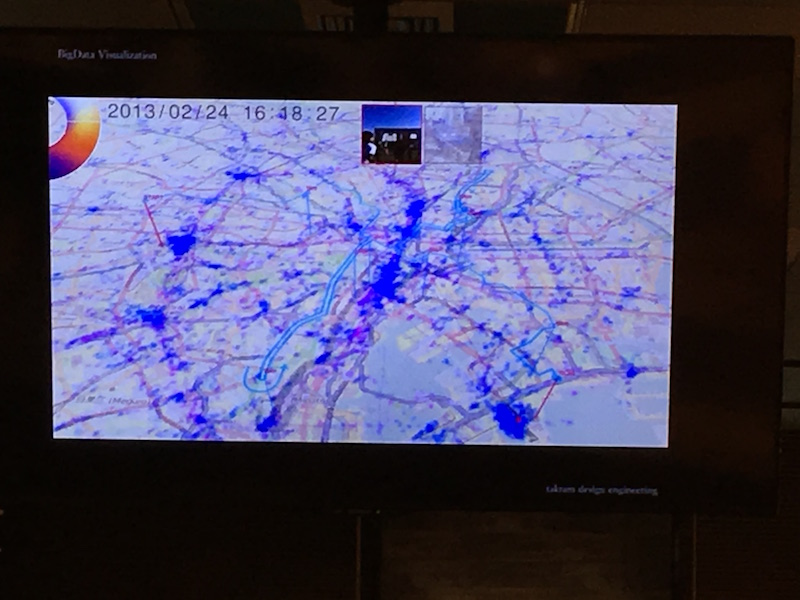
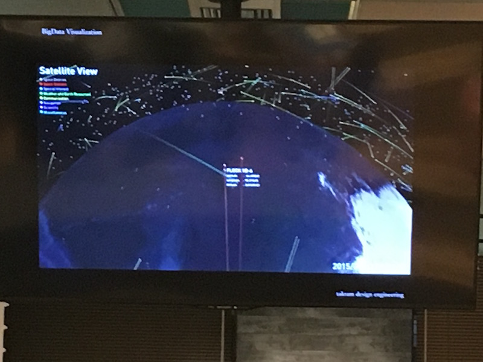
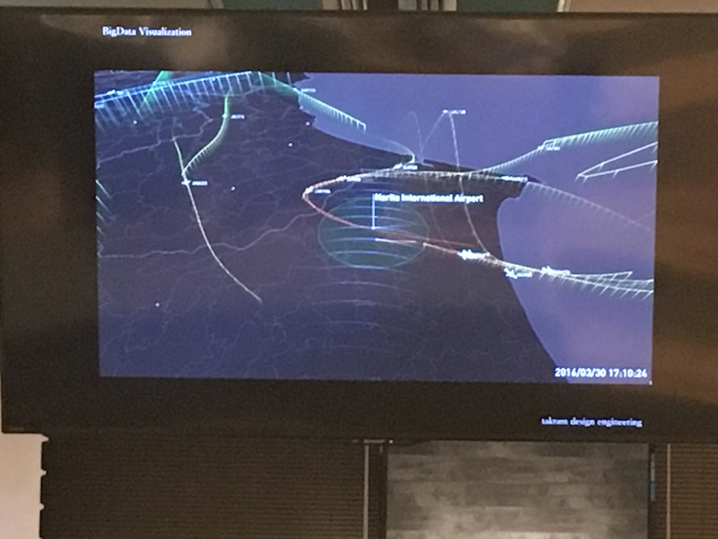
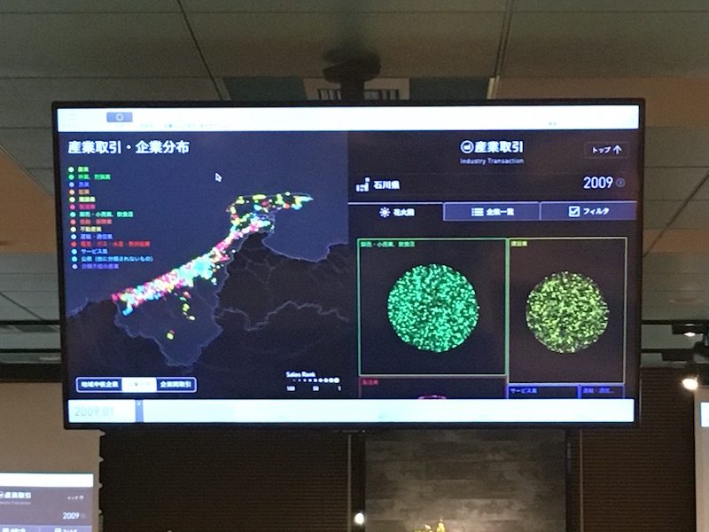
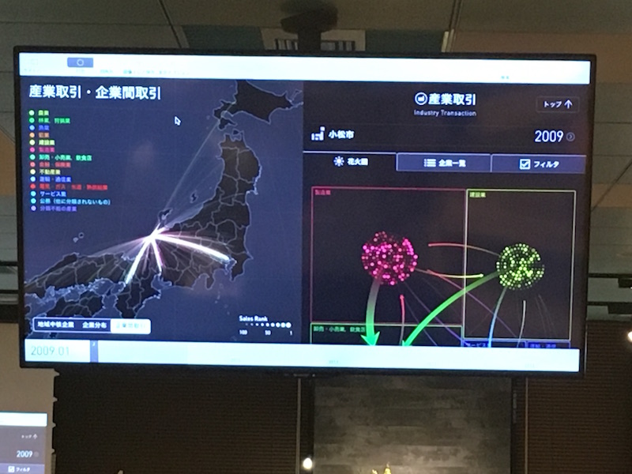

# UX生トーク vol.4
## 1.
間に合わず
## 2.サービスをグロースするためのデザイン × エンジニアリング（リブセンス前田さん）
### ieshil（不動産価格査定サイト）の事例紹介
* マンションの相場の適正価格をビッグデータを使って透明化する
* 不動産の売買を安心してできるようにする

### 対応範囲
* デザイン〜フロントエンド開発〜企画

### なぜ広範囲で仕事をしているか？
新規事業ゆえの宿命で
* 圧倒的な人材リソース不足
* コミュニケーションが重要

### ノーマンの言葉
* 機能的でわかりやすく便利だけでは不十分〜
-> これを満たしていても

### ビジネスを理解しないまま、開発、デザインするとどうなるか？
* 企画とそりが合わず喧嘩になります
* サービスを運営する意義、重要性を理解する必要がある

### イームズの言葉
* デザインの問題を解決するにはコツがある、〜
-> しかし、

### 自分の視点からだけのルール、制約を作ってデザインすると
* エンジニアと喧嘩になる
* 実現可能性や真に使われる機能なのかを知る

### ビジネス、テクノロジーを理解していないと
* 意思疎通ができない
* コミュニケーションロスにより、
* 最終的に事業撤退となりうる

### デザイナーもBTC（Business, Technology、Creative）の3軸を理解して、サービスデザインする必要がある
* 事業のグロースができる

### 具体的な方法
1. サービスをグロースさせるためのアイデアを検討する
2. 実際に作ってみる
  * ieshilではSketchで作って、共有したが
  * インブラウザデザイン
    * ブラウザのDeveloperToolを使って
  * ツールを使って実装
    * ABテストツールで直接編集
  * ソースコードをいじる
    * プロトタイプツールを使っても良いが、ieshilの場合はWebメインだったのでインタラクティブな表現が素早くできる
  * gitでコミットする
    * デザイナーでもgitを使い、エンジニアのレビューを踏まえて自分でリリースまでできる
  * デザインから実装、本番リリースまで完結してできることで
3. 計測をしてユーザの反応がどうだったかを知る

### 新規事業だからこそ、価値仮説を検証しながら開発する
### Build Measure Learnサイクル
### これらのリーンサイクルにデザイナーが関わるとどうなるか
* サービスを作っている実感
* サービスを作る楽しさ、つらさが実感できる

事業会社のデザイナーに取って重要なこと
* 自分ごととして課題を捉えて
* 個人ではなくチーム共創できるか

www.ieshil.com

## 3.デザイナーがAbemaTVの実装に携わってみて感じたこと（サイバーエージェント内田さん）
### AbemaTV
* インターネットTV局
* 現在26チャンネル
* テレビ朝日との競業
* iOS/Androidで600万DL
* 開発チームは30〜40人、事業全体で200人ぐらい

### デザイナーがコードを触った
### プロセス
1. モック制作
  Facebookのインフィード再生みたいなUIがいい、という
  * AfterEffect/Flashで動画によるモック
  * 最初は縦画面だったが、モック制作後、
    -> 「やっぱり、横だね」
  * Pixtateを使って、モックを作り込んだ
  * 触れるのでエンジニア、ビジネス側の人に伝えやすい
  * 最初の4ヶ月はずっとモックを作っていた
    -> 200ファイルぐらい
2. ソースを触る
  * エンジニアに実装してもらったものを元に
    * iOS: Xcodeによる動きの微修正
    * Android: Android StudioでXMLをいじる
    * Web: Sublime Textでレイアウト調整

  * どうやって、デザイナーとして実装に関わる一歩を踏み出したか
  1. 自分がアプリを作っていることを匂わせる
  2. リアルなプロダクトを重視する流れがあった
  3. 社内でテクニカルエンジニアという職種を

3. githubを使う
* githubを使うことが重要だった
* エンジニアにレビューしてもらう

### よかったこと
* クオリティの改善サイクルが早い
  * アニメーションのパラメータの変更などデザイナーがやって確認できたほうが早い
* エンジニアに頼む心苦しさがない

### 改善点
* タスクとしてきちんと時間をとるべき
* 何でも屋になってしまわないように

### 現在開発中のAppleTV向けAbemaTVアプリ
* モック制作から関わっている
* デモ

## 4.takramの考えるデザインエンジニアリング（Takram Design Engineering櫻井）

### About Takram
* タムロンというカメラレンズメーカーのプロダクトデザインや事業戦略
* とらやと和菓子のデザイン
* トヨタと一緒にカーインテリアのコンセプトデザイン
* NHKの番組ミミクリーずの制作

### BigData Visualization
* いろいろなプロジェクトのデモ

* 帝国データバンクのデータの可視化プロジェクト：プロトタイププロセスを国に提案して、有用なデータを見つけることができるソフトウェアを開発した
-> グッドデザイン賞の金賞
* Xcodeで開発されてる

#### Visualaizationの二つのパターン
* 目的を持ったビジュアライゼーション
  * 抽出されたデータ
  * カーナビなど
* 目的を見つけるためのビジュアライゼーション

#### 多くの情報をどうやって収めるか
* 認知限界
* 情報圧縮
-> 情報を減らす方向だけでなく、ビジュアルによる情報を増やす

* 主観 <-> 俯瞰
* 詳細 <-> 全体
これらを同時に捉えるにはどうしたらいいだろうか

### Design Engineering
* プロセス
  * Sketch
  * Dirty Prototype
  * Technical ProtoType
  * Styling Prototype
  * Working Prototype
  * Movie Prototype

* デザインエンジニアとは
  * ハイブリッドタイプ
  * 複眼的思考
  * 越境性
  * 振り子的な思考、行動プロセス
    * 抽象 <-> 具象
    *  <-> プロトタイピング
* takramのコンセプト
  takram (not) design (or) engineering
