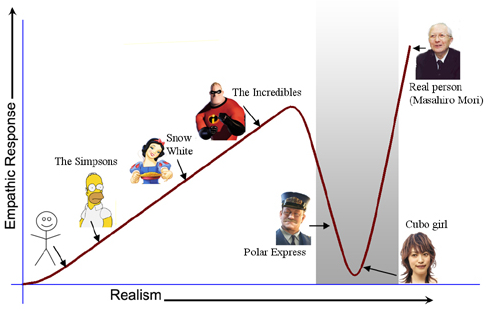
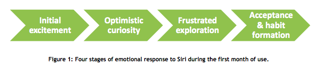

# サービスデザインサロン vol9「音声認識で考える『相棒』とのインタラクション」 20150807

## クルマのUXと音声認識/星 貴史（株式会社コンセント サービスデザイナー）
（途中から参加）
### 車に求められる音声認識
* 走行ノイズなど、環境音下での適切な認識
* 適切な手操作との連携（音声のみだとストレスに）
* 適切なタイミング
* システムを意識せず短い習熟期間で利用出来ること

音声認識の利用率は国や文化的背景に左右されやすく、日本における利用率は欧米に比べてまだ低い。

### コンシェルジュに求められる音声認識（今、各クルマメーカはこのあたりのことを考えている）
* 「いつもの」で通じる的確なユーザ嗜好・行動分析
* 各種情報の先読み
* ユーザに対する固有感、カスタマイズ感

### 相棒に求められる音声認識
* 発音のみではない、ニュアンスの読み取り
* ユーザとの間に築かれた1対1の関係性
* より明確なコミュニケーション対象の明示  
  ロボット、キャラクター、お姉さんの画像とかコミュニケーションの対象がいないと不安になるのではないか
* （個性ある）人格性の確立
* 雑談が可能など

### 車のキャラクター
* 音声認識の進化によってより身近な存在となる
  * コンシェルジュ
  * 相棒
  * ペット
  * 家族
* 自動運転化された場合には？  
運転しない時間が多くなる、運転できない人ものる
  * 保護者
  * 統率者
  * エンターテイナー

### 自動運転が実現された場合には
* 運転/安全からの解放
* 運転支援からエンターテイメント
など別の観点が必要になると考えている

### クルマとスマホの関係
* 音声でやりとりする機器としてスマホの存在感は大きい
* スマホでの音声認識の普及が社内利用のきっかけに
* 普段使っているスマホ（相棒）をそのまま車内でも利用
誰に向かってしゃべっているのかが肝になる

### まとめ
* クルマでの音声認識は、その使わせ方(UXが定義)が重要
* 同様な音声認識機器であるスマホとの関係性に注目
* 言語/文化的背景に対する対処・チューニングは必要

### Q&A

* 今は単純に言語を認識するだけではなく、文脈の解釈が重要になっている
* テキストだと前後の文脈が類推できるが、音声だとリアルタイムで解析する必要があるので類推が難しい
* 車の表情とキャラクターの一致について
  * 周りに対して柔らかいみたいなのがあってもいいかとは個人的に思ってるが、今の車は悪い顔が多い
  * 車の場合はiPhoneとかと違って抽象化されていないので人格化されやすい

## interaction Design of Artificial Intelligence / イ・ソヨン（AQ株式会社 UXデザイナー）
以下のiOSアプリのUXデザインを担当した
* yahoo音声アシスト
* Alpaka

### ex machinaという映画
* 人口知能を持ったロボットがでてくる
* 副題：What happens to me if I fail your test?  
  AIの判定をチューリングテストで行うが、テストを行う人間がAIに揺さぶられていく話ろのこと（日本では未公開）  
* Turing Test  
  wikipedia：https://ja.wikipedia.org/wiki/%E3%83%81%E3%83%A5%E3%83%BC%E3%83%AA%E3%83%B3%E3%82%B0%E3%83%BB%E3%83%86%E3%82%B9%E3%83%88  
  人工知能か人間かを判定するテスト  
  AとBに対して会話して、CがAとBのどちらがコンピュータか区別ができるか  
  人間の認知の不完全さを利用したテスト  

  

* 人間にとって人工知能が人間に見えてしまうようになるとどうなるかが描かれている
* 2014年、「13歳の少年」の設定で参加した人工知能が初めてチューリングテストに合格した  
→ ビル・ゲイツやイーロン・マスクなどが人工知能の進化に危惧を示した

### 現代の心配と昔のSF（ターミネーターとかアイザック・アシモフとか）の心配の違い
* 人工知能の進化への危惧は昔からあった  
  昔の悪いロボットはみんな目が赤くて分かりやすい！  
* 現代では蓄積された大量のデータを利用している  
  Big Data
* 人工知能か人間の知能かが分からないというところまできている

### 人工知能のUXデザインのポイントとなる点

1. Rerationship 関係性
  * 映画「her」にでてくる人工知能  
  人工知能と人間との新しい関係性が生まれたことを想定して、UIのデザインも考えられている

2. Form 形

  * ざっくり分けると形があるかないか（透過型と人間型）
    * 透過型の代表：siri
    * 人間型の代表：Assistantというアプリやアンドロイド
  * 形のないデザインのいいところは実際の姿はユーザに想像させることができる
  * 人間型のデザインの場合は有名な不気味の谷が問題 POLAエクスプレスのトムハンクスやcubo girl（https://www.youtube.com/watch?v=PF1NQFmOoAE）

    

    → デザインの戦略としては不気味の谷の前でとめるのが良いと思う

3. Conversation 対話

  * vi（エディター）について
      * 機械に合わせて不自然にコマンドを打つ必要がある（iと打ってモードを変えてからテキストを入力するなど）
  * google検索  
  検索窓に「鎌倉 ランチ」とか打つが、これも機械に合わせたインタラクションで自然ではない、人にいくときはそんな風には聞かない
  * Blink UX社によるsiriとのUXの分析（http://www.blinkux.com/_downloads/Blink_Siri_White_Paper.pdf)
  
    1. 最初はウキウキ
    2. ポジティブな好奇心
    3. イラつきながらいろいろ試す
    4. 受け入れる&習慣の形成（習慣的に使える機能だけ使う）

  * イラつく原因は？
    * 会話の修復ができない
      * 相手の修復による修正
      * 明日マークに会うの。
      * 誰？
      * 明日マイクと会うの。ごめんね。  
      siriの場合、分からない場合に文脈と関係ないレスポンスが来ることがある

  * 会話の修復の役割
    * 声のインタラクションにおける認知の不可を減らす
    * 確実に成功的な結果を導く
    * インタラクションをより自然に
  * 例えば、、、前職で関わった音声認識アプリでは  
    列車検索すると１本後や1本前も同時に提示するなど工夫した

4. Status 状態  
Watsonの例
  * 自信がないときの表示や考え中の表示などステータスが示される

5. Contents コンテンツ
  * 人々の役に立つためにはどういうプロダクトを作らないといけないかを考える必要がある  
  　アニメーションや表現だけではなく、人間にとってほんとにありがたいコンテンツを提示する

### yahoo音声アシストではどんなことをしたか
* ペルソナを作ったり
* ジャーニーマップを作ったり
* 人形を作ってシュミレーションをしたり

### Q&A

* 西洋人にあるようなAIに対する危機感はどうやって解けるか  
    危機感を解くべきだとは思わない。技術に対して最悪の場合どういうことが起きることを考える必要はあると思う

* pepperについてどう思うか
    * 岡田 美智男さん（豊橋工科大学）が  
    労働の代替ではない、弱いロボットを研究している  
    代替ではなく、人間の活動の助長  
    岡田さん曰く、pepperは弱いロボットを体現しようとしている

    * 同じように弱いAIというのもあるのではないか  
      watsonのような強い相棒だけでなく、弱い相棒もあっても良いと思う

    * 個人的（コンセントの長谷川さん）には、IAにおいても理解させるように強いるIAだけでなく、弱い、理解しようと促す、IAもあるのでは、などと考えている  
    * siriも頭の良さそうな感じではなく、バカそうにするとイラつかないかもしれない  
    かしこそうにつくりすぎているのかも
    pepperはいい感じにばかそうなデザイン（筐体、音声など）になっている

  * AIの開発において日本語が母国語であることは問題になるか  
    日本語は表層構造的な言語、欧文言語と構造が違うと言われるが言語解析や文脈の推定などでハードルがあがったりするのか
    * 専門家ではないので詳しくは分からないが、文末で意味変わっちゃう、条件付けが違う、省略されるところや類推するところも違うというのはあると聞いた
    * watsonの開発者に聞いたところ、watsonについては日本語対応するのにアルゴリズム的な対応は必要ではないとのことだった  
    watsonの場合は大量のデータを探索することを前提にしており、リアルタイムで文脈を類推するような前提ではないためかもしれない
